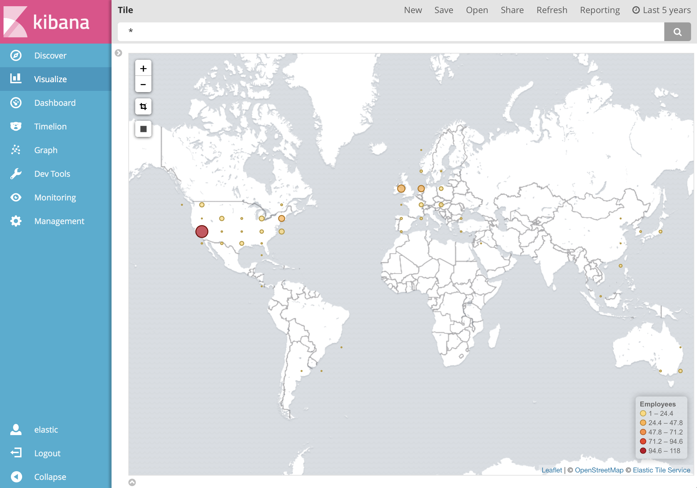

# pyngboard

Pingboard adapter for Elasticsearch, enhancing locations with geocoding.



## Installation
Install `python3`, e.g., on Mac:
```
brew install python3
```

Install Python dependencies:

```
pip3 install elasticsearch googlemaps pyyaml
```

## Usage
See [pyngboard.yml](pyngboard.yml) for API configuration and custom mappings.

### Pingboard API
Request an API service account to your account admin.

### Google Maps API
Create a key [here](https://developers.google.com/maps/documentation/geocoding/get-api-key#key).
